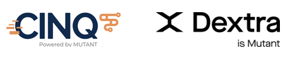

	

    
	

  

    
    
    
  

# Awesome dextra

A curated list of open source projects created or maintained by Dextra employees.

Dextra is a Software development company which is really proud of the great work that its employees do on the open source community, this list is a simple way to show those awesome projects.

## Contents

 - [Flutter](#flutter-)
 - [JavaScript](#javascript-)
 - [.NET](#net-)
 - [TypeScript](#typescript-)

<h1>Flutter </h1>

 - [Dashbook](https://github.com/erickzanardo/dashbook) - Documentation and sandbox tool for Flutter. Author: [Erick Zanardo](https://github.com/erickzanardo/)
 - [Flame](https://github.com/flame-engine/flame) - A game engine written on top of Flutter. Maintainer: [Erick Zanardo](https://github.com/erickzanardo/)

<h1>Javascript </h1>

 - [Graphql Import Files](https://github.com/tiago154/graphql-import-files) - Light and easy package that will load .graphql files and use them with syntax highlighting. Author: [Tiago Silva](https://github.com/tiago154)
 - [Nanoflux](https://github.com/ohager/nanoflux) - Very lightweight, depency-free Flux implementation. Author: [Oliver Hager](https://github.com/ohager)
 - [Stappo](https://github.com/ohager/stappo) - Extremely tiny Application State Manager written in Javascript (less than 300 bytes). Author: [Oliver Hager](https://github.com/ohager)

<h1>Typescript </h1>

 - [Phoenix Burst Wallet](https://github.com/burst-apps-team/phoenix) - Cross-platform for the Burstcoin blockchain. Co-Author/Maintainer: [Oliver Hager](https://github.com/ohager)
 - [@burstjs](https://burst-apps-team.github.io/phoenix) - Reference Library for Burstcoin blockchain platform. Co-Author/Maintainer: [Oliver Hager](https://github.com/ohager)

<h1>.NET </h1>

 - [DexQuiz](https://github.com/dextra/dexquiz) - A simple quiz with different tracks, to be used in events to engage people with the company and also help with gifts and awards. Author: [Gustavo Bigardi](https://github.com/gustavobigardi)

## Contributing

To add your own projects to this list, please check the [CONTRIBUTING](CONTRIBUTING.md) guide.
