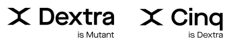

	

    
	

  

    
    
    
  

# Awesome Dextra

A curated list of open source projects created or maintained by [Dextra](https://dextra.com.br/) employees.

Dextra is a Software development company which is really proud of the great work that its employees do on the open source community, this list is a simple way to show those awesome projects.

> In case, you a have promising project, which is not ready for public yet and that may do its way into this list, don't hesitate to apply for our [Promising Projects List](./PROMISING.md).

## Contents

 - [Android](#android-)
 - [Flutter](#flutter-)
 - [Golang](#golang-)
 - [JavaScript](#javascript-)
 - [SQL](#sql-)
 - [Swift](#swift-)
 - [TypeScript](#typescript-)
 - [.NET](#net-)

 <h1>Android </h1>

 - [IridescentView](https://github.com/alexandrehtrb/IridescentView) - A custom ImageView with iridescence effect. Author: [Alexandre Bonfitto](https://github.com/alexandrehtrb/)

<h1>Flutter </h1>

 - [Bifrost](https://github.com/dextra/flutter_bifrost) - A plugin which enables easy embedding of your Flutter application into your existing native apps. Author: [Matheus Lutero](https://github.com/matheuslutero/), Maintainer: [Dextra](https://github.com/dextra/)
 - [Dashbook](https://github.com/erickzanardo/dashbook) - Documentation and sandbox tool for Flutter. Author: [Erick Zanardo](https://github.com/erickzanardo/)
 - [DextrAquario](https://github.com/dextra/dextraquario) - Platform to hold contribution competitions written with Flutter and Flame for web. Co-Author: [Erick Zanardo](https://github.com/erickzanardo/), Co-Author [Tyemy Kuga](https://github.com/tyemykuga)

 - [Flame](https://github.com/flame-engine/flame) - A game engine written on top of Flutter. Maintainer: [Erick Zanardo](https://github.com/erickzanardo/)

<h1>Golang </h1>

 - [golang-health-checker](https://github.com/gritzkoo/golang-health-checker) - A package that allows you to track your application health providing two ways of checking, with and without integrations, to standardize implementations cross microservices and for applications that are running in k8s, provide liveness and readiness approach. Author: [Gritzko D. Kleiner](https://github.com/gritzkoo)
 - [Hare](https://github.com/leozz37/hare) - User-friendly library for sockets in Golang. You can send and listen to TCP connections with a few lines of code. Author: [Leonardo Lima](https://github.com/leozz37)

<h1>Javascript </h1>

 - [Graphql Import Files](https://github.com/tiago154/graphql-import-files) - Light and easy package that will load .graphql files and use them with syntax highlighting. Author: [Tiago Silva](https://github.com/tiago154)
 - [Nanoflux](https://github.com/ohager/nanoflux) - Very lightweight, dependency-free Flux implementation. Author: [Oliver Hager](https://github.com/ohager)
 - [Stappo](https://github.com/ohager/stappo) - Extremely tiny Application State Manager written in Javascript (less than 300 bytes). Author: [Oliver Hager](https://github.com/ohager)
 - [Burnify](https://github.com/feroult/burnify) - Highly interactive product burn-down charts. Author: [Fernando Ultremare](https://github.com/feroult)
 - [Burst dAppository](https://github.com/ohager/burst-dappository) - A decentralized 'App Store' built on [Burst](https://www.burst-coin.org/) blockchain platform using Smart Contracts and NFT (_DApp_) where devs can promote their contributions. Built with ❤️and SvelteJS!
   Live: https://burst.dappository.world/
   Author: [Oliver Hager](https://github.com/ohager)
 - [Philentropyst](https://github.com/ohager/philentropyst) - Efficient Data Masking/Anonymization tool for structured text files (CSV, ...)  
   Author: [Oliver Hager](https://github.com/ohager)

<h1>SQL </h1>

- [Dataform Project Template](https://github.com/oliveiraJessica/cookiecutter-dataform) - This project was developed to create templates in Dataform using CookieCutter tool. Dataform enables data teams to build scalable, tested, SQL based data transformation pipelines using version control and engineering inspired best practices. Co-Author/Maintainer: [Valéria Silva](https://github.com/vvalcristina), [Jéssica Oliveira](https://github.com/oliveiraJessica)

<h1>Swift </h1>

- [BricksAndTiles](https://github.com/mugbug/BricksAndTiles) -
🧱 A composable solution for building reusable lists in Swift/UIKit. As easy as playing with Legos. Co-Author/Maintainer: [Pedro Zaroni](https://github.com/mugbug)

<h1>Typescript </h1>

 - [@burstjs](https://burst-apps-team.github.io/phoenix) - Reference Library for Burstcoin blockchain platform. Co-Author/Maintainer: [Oliver Hager](https://github.com/ohager)
 - [nodejs-health-checker](https://github.com/gritzkoo/nodejs-health-checker) - A package that allows you to track your application health providing two ways of checking, with and without integrations, to standardize implementations cross microservices and for applications that are running in k8s, provide liveness and readiness approach. Authors: [Gritzko D. Kleiner](https://github.com/gritzkoo) and [João Pedro Mantovani](https://github.com/joaomantovani)
 - [Phoenix Burst Wallet](https://github.com/burst-apps-team/phoenix) - Cross-platform crypto coin wallet for the Burstcoin blockchain. Co-Author/Maintainer: [Oliver Hager](https://github.com/ohager)

<h1>.NET </h1>

 - [DexQuiz](https://github.com/dextra/dexquiz) - A simple quiz with different tracks, to be used in events to engage people with the company and also help with gifts and awards. Authors: [Gustavo Bigardi](https://github.com/gustavobigardi), [Gabriel Cordeiro](https://github.com/Gabriel-Cordeiro), [Bruno Habbermann](https://github.com/bhabermann) and [Alexandre Bonfitto](https://github.com/alexandrehtrb)

## Contributing

To add your own projects to this list, please check the [CONTRIBUTING](CONTRIBUTING.md) guide.
